# 🏗️ Delox System Architecture

## Overview

Delox is a modern, cloud-native SaaS delivery management platform built with microservices architecture. The system is designed for scalability, maintainability, and multi-tenant isolation.

## 🎯 Architecture Principles

- **Microservices Architecture**: Independent, loosely coupled services
- **Multi-Tenant SaaS**: Workspace-based tenant isolation
- **Event-Driven Communication**: Asynchronous messaging between services
- **API-First Design**: RESTful APIs with OpenAPI documentation
- **Container-Native**: Docker containerization for all components
- **Cloud-Ready**: Kubernetes deployment support

## 🏛️ High-Level Architecture

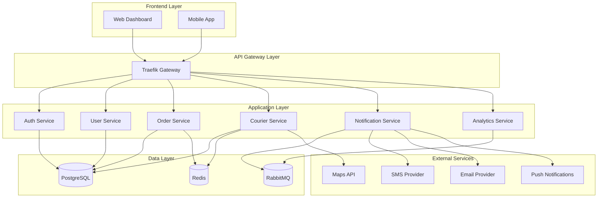
```mermaid
graph TB
    subgraph "Frontend Layer"
        WEB[Web Dashboard]
        MOBILE[Mobile App]
    end
    
    subgraph "API Gateway Layer"
        GATEWAY[Traefik Gateway]
    end
    
    subgraph "Application Layer"
        AUTH[Auth Service]
        USER[User Service]
        ORDER[Order Service]
        COURIER[Courier Service]
        NOTIFY[Notification Service]
        ANALYTICS[Analytics Service]
    end
    
    subgraph "Data Layer"
        DB[(PostgreSQL)]
        CACHE[(Redis)]
        QUEUE[(RabbitMQ)]
    end
    
    subgraph "External Services"
        MAPS[Maps API]
        SMS[SMS Provider]
        EMAIL[Email Provider]
        PUSH[Push Notifications]
    end
    
    WEB --> GATEWAY
    MOBILE --> GATEWAY
    
    GATEWAY --> AUTH
    GATEWAY --> USER
    GATEWAY --> ORDER
    GATEWAY --> COURIER
    GATEWAY --> NOTIFY
    GATEWAY --> ANALYTICS
    
    AUTH --> DB
    USER --> DB
    ORDER --> DB
    COURIER --> DB
    
    ORDER --> CACHE
    COURIER --> CACHE
    
    NOTIFY --> QUEUE
    ANALYTICS --> QUEUE
    
    COURIER --> MAPS
    NOTIFY --> SMS
    NOTIFY --> EMAIL
    NOTIFY --> PUSH
```

## 🔧 Service Architecture

### Core Services

#### 1. Authentication Service (Port 8001)
**Responsibility**: User authentication, JWT token management, authorization

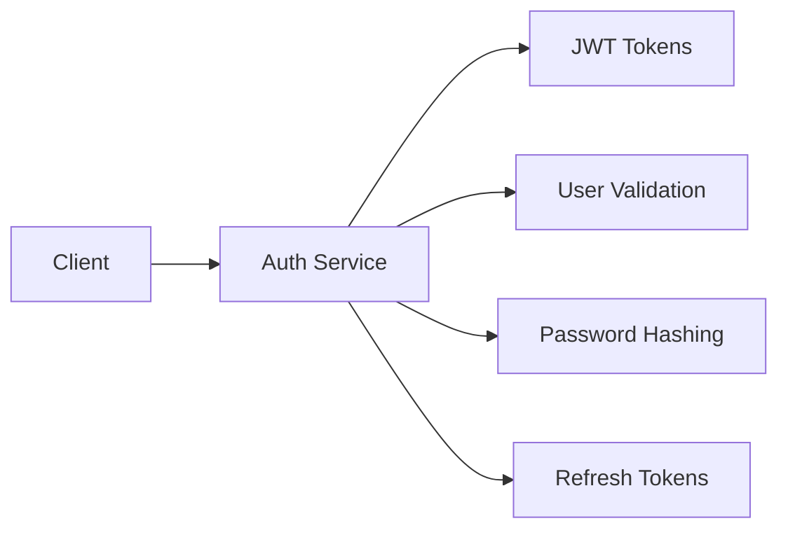
```mermaid
graph LR
    A[Client] --> B[Auth Service]
    B --> C[JWT Tokens]
    B --> D[User Validation]
    B --> E[Password Hashing]
    B --> F[Refresh Tokens]
```

**Key Features**:
- JWT-based authentication
- Refresh token rotation
- Password hashing (bcrypt)
- Multi-tenant user isolation
- Role-based access control

#### 2. User Management Service (Port 8002)
**Responsibility**: User profiles, workspace management, RBAC

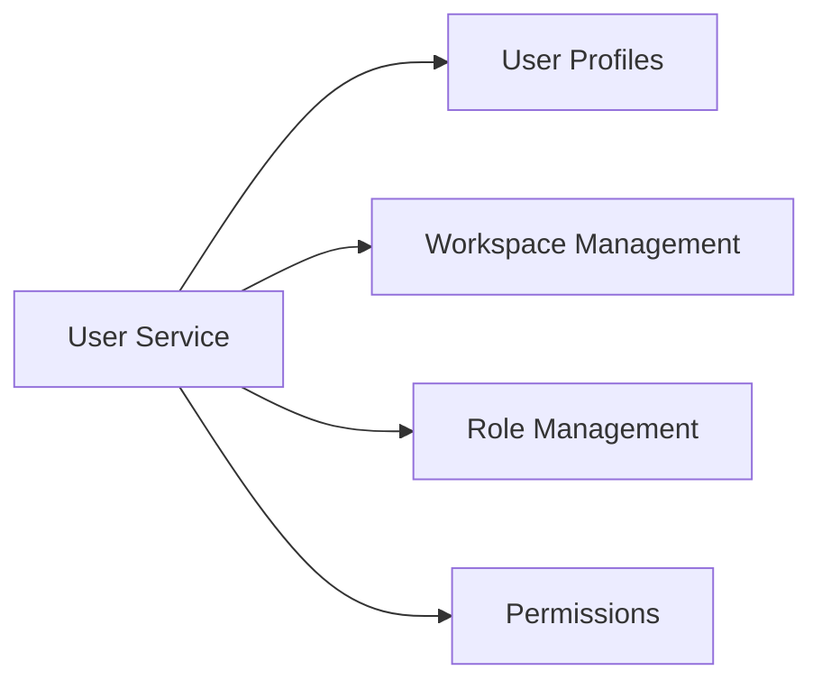
```mermaid
graph LR
    A[User Service] --> B[User Profiles]
    A --> C[Workspace Management]
    A --> D[Role Management]
    A --> E[Permissions]
```

**Key Features**:
- Workspace creation and management
- User profile management
- Role-based permissions
- Multi-workspace user support
- Audit logging

#### 3. Order Management Service (Port 8003)
**Responsibility**: Order lifecycle, status tracking, customer management

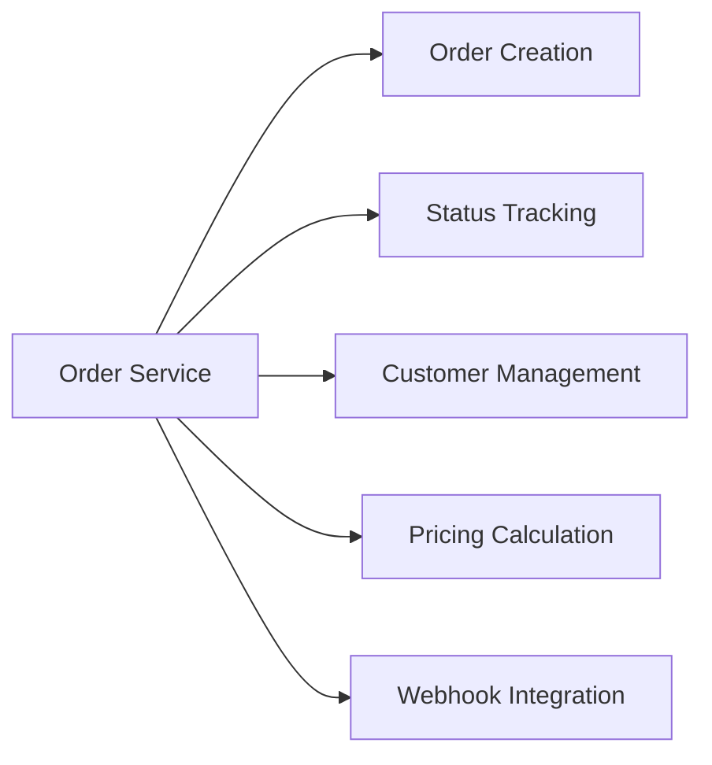
```mermaid
graph LR
    A[Order Service] --> B[Order Creation]
    A --> C[Status Tracking]
    A --> D[Customer Management]
    A --> E[Pricing Calculation]
    A --> F[Webhook Integration]
```

**Key Features**:
- Complete order lifecycle management
- Real-time status updates
- Customer information management
- Pricing and billing integration
- External API webhooks

#### 4. Courier & Route Service (Port 8004)
**Responsibility**: Courier management, route optimization, GPS tracking

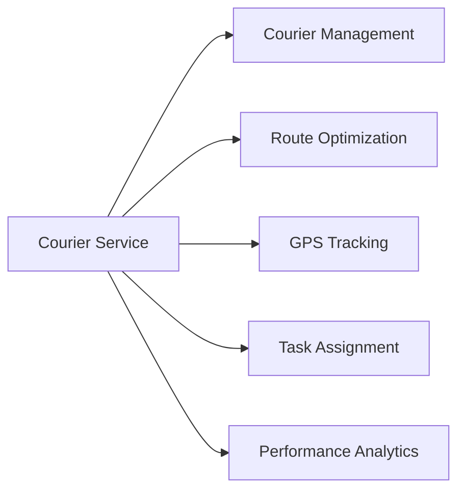
```mermaid
graph LR
    A[Courier Service] --> B[Courier Management]
    A --> C[Route Optimization]
    A --> D[GPS Tracking]
    A --> E[Task Assignment]
    A --> F[Performance Analytics]
```

**Key Features**:
- Real-time GPS tracking
- Route optimization algorithms
- Task assignment (manual/automatic)
- Performance metrics
- Mobile app API support

#### 5. Notification Service (Port 8005)
**Responsibility**: Multi-channel notifications, templates, campaigns

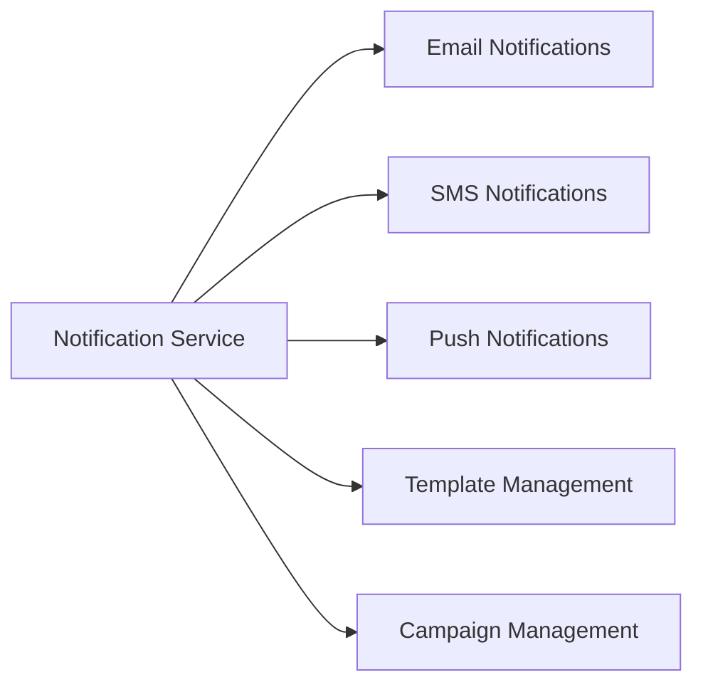
```mermaid
graph LR
    A[Notification Service] --> B[Email Notifications]
    A --> C[SMS Notifications]
    A --> D[Push Notifications]
    A --> E[Template Management]
    A --> F[Campaign Management]
```

**Key Features**:
- Multi-channel delivery (Email, SMS, Push, In-App)
- Template-based messaging
- Campaign management
- Delivery tracking and analytics
- Webhook event notifications

#### 6. Analytics & Reporting Service (Port 8006)
**Responsibility**: Business intelligence, metrics aggregation, reporting

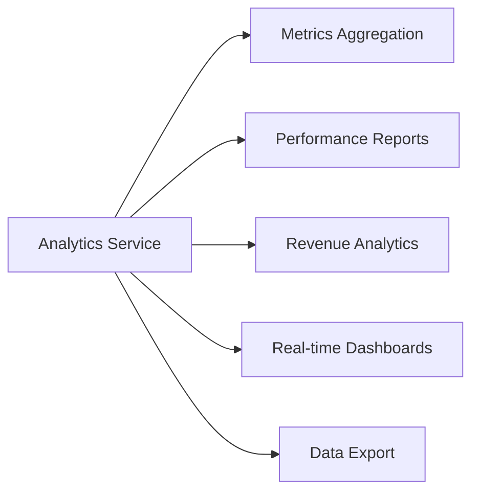
```mermaid
graph LR
    A[Analytics Service] --> B[Metrics Aggregation]
    A --> C[Performance Reports]
    A --> D[Revenue Analytics]
    A --> E[Real-time Dashboards]
    A --> F[Data Export]
```

**Key Features**:
- Real-time metrics aggregation
- Performance analytics
- Revenue and financial reporting
- Custom dashboard creation
- Data export capabilities

## 🌐 Network Architecture

### Service Communication

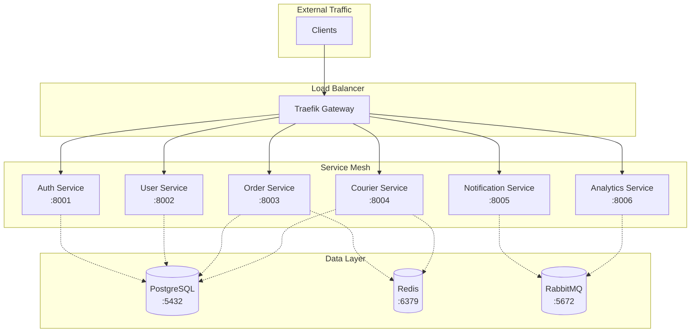
```mermaid
graph TB
    subgraph "External Traffic"
        CLIENT[Clients]
    end
    
    subgraph "Load Balancer"
        LB[Traefik Gateway]
    end
    
    subgraph "Service Mesh"
        AUTH[Auth Service<br/>:8001]
        USER[User Service<br/>:8002]
        ORDER[Order Service<br/>:8003]
        COURIER[Courier Service<br/>:8004]
        NOTIFY[Notification Service<br/>:8005]
        ANALYTICS[Analytics Service<br/>:8006]
    end
    
    subgraph "Data Layer"
        DB[(PostgreSQL<br/>:5432)]
        REDIS[(Redis<br/>:6379)]
        RABBIT[(RabbitMQ<br/>:5672)]
    end
    
    CLIENT --> LB
    LB --> AUTH
    LB --> USER
    LB --> ORDER
    LB --> COURIER
    LB --> NOTIFY
    LB --> ANALYTICS
    
    AUTH -.-> DB
    USER -.-> DB
    ORDER -.-> DB
    COURIER -.-> DB
    
    ORDER -.-> REDIS
    COURIER -.-> REDIS
    
    NOTIFY -.-> RABBIT
    ANALYTICS -.-> RABBIT
```

### Port Allocation

| Service | Internal Port | External Port | Protocol |
|---------|---------------|---------------|----------|
| Frontend Dashboard | 80 | 3000 | HTTP |
| API Gateway | 80 | 8080 | HTTP |
| Traefik Dashboard | 8080 | 8081 | HTTP |
| Auth Service | 8000 | 8001 | HTTP |
| User Service | 8000 | 8002 | HTTP |
| Order Service | 8000 | 8003 | HTTP |
| Courier Service | 8000 | 8004 | HTTP |
| Notification Service | 8000 | 8005 | HTTP |
| Analytics Service | 8000 | 8006 | HTTP |
| PostgreSQL | 5432 | 5432 | TCP |
| Redis | 6379 | 6379 | TCP |
| RabbitMQ | 5672 | 5672 | AMQP |
| RabbitMQ Management | 15672 | 15672 | HTTP |

## 📊 Data Architecture

### Database Design

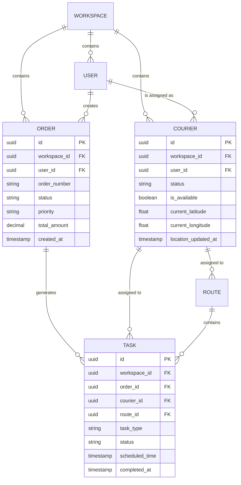
```mermaid
erDiagram
    WORKSPACE ||--o{ USER : contains
    WORKSPACE ||--o{ ORDER : contains
    WORKSPACE ||--o{ COURIER : contains
    
    USER ||--o{ ORDER : creates
    USER ||--o{ COURIER : "is assigned as"
    
    ORDER ||--o{ TASK : "generates"
    COURIER ||--o{ TASK : "assigned to"
    
    ROUTE ||--o{ TASK : contains
    COURIER ||--o{ ROUTE : "assigned to"
    
    ORDER {
        uuid id PK
        uuid workspace_id FK
        uuid user_id FK
        string order_number
        string status
        string priority
        decimal total_amount
        timestamp created_at
    }
    
    COURIER {
        uuid id PK
        uuid workspace_id FK
        uuid user_id FK
        string status
        boolean is_available
        float current_latitude
        float current_longitude
        timestamp location_updated_at
    }
    
    TASK {
        uuid id PK
        uuid workspace_id FK
        uuid order_id FK
        uuid courier_id FK
        uuid route_id FK
        string task_type
        string status
        timestamp scheduled_time
        timestamp completed_at
    }
```

### Multi-Tenant Data Isolation

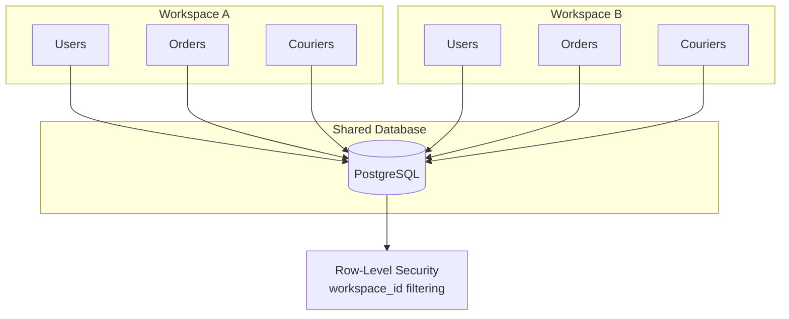
```mermaid
graph TB
    subgraph "Workspace A"
        WA_USERS[Users]
        WA_ORDERS[Orders]
        WA_COURIERS[Couriers]
    end
    
    subgraph "Workspace B"
        WB_USERS[Users]
        WB_ORDERS[Orders]
        WB_COURIERS[Couriers]
    end
    
    subgraph "Shared Database"
        DB[(PostgreSQL)]
    end
    
    WA_USERS --> DB
    WA_ORDERS --> DB
    WA_COURIERS --> DB
    
    WB_USERS --> DB
    WB_ORDERS --> DB
    WB_COURIERS --> DB
    
    DB --> ISOLATION[Row-Level Security<br/>workspace_id filtering]
```

## 🔄 Event-Driven Architecture

### Message Flow

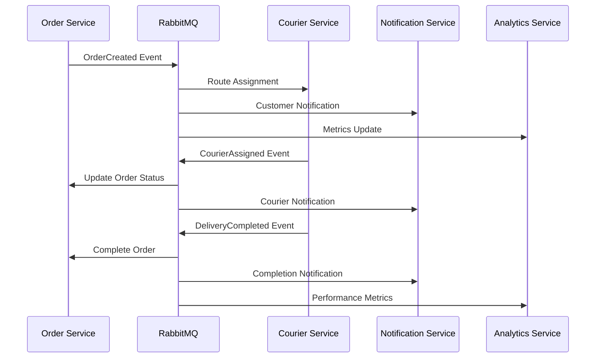
```mermaid
sequenceDiagram
    participant O as Order Service
    participant Q as RabbitMQ
    participant C as Courier Service
    participant N as Notification Service
    participant A as Analytics Service
    
    O->>Q: OrderCreated Event
    Q->>C: Route Assignment
    Q->>N: Customer Notification
    Q->>A: Metrics Update
    
    C->>Q: CourierAssigned Event
    Q->>O: Update Order Status
    Q->>N: Courier Notification
    
    C->>Q: DeliveryCompleted Event
    Q->>O: Complete Order
    Q->>N: Completion Notification
    Q->>A: Performance Metrics
```

### Event Types

| Event | Producer | Consumers | Description |
|-------|----------|-----------|-------------|
| `order.created` | Order Service | Courier, Notification, Analytics | New order created |
| `order.assigned` | Order Service | Courier, Notification | Order assigned to courier |
| `order.completed` | Order Service | Notification, Analytics | Order delivery completed |
| `courier.location_updated` | Courier Service | Analytics, Notification | GPS location update |
| `route.optimized` | Courier Service | Order, Notification | Route optimization completed |
| `notification.sent` | Notification Service | Analytics | Notification delivery status |

## 🔐 Security Architecture

### Authentication Flow

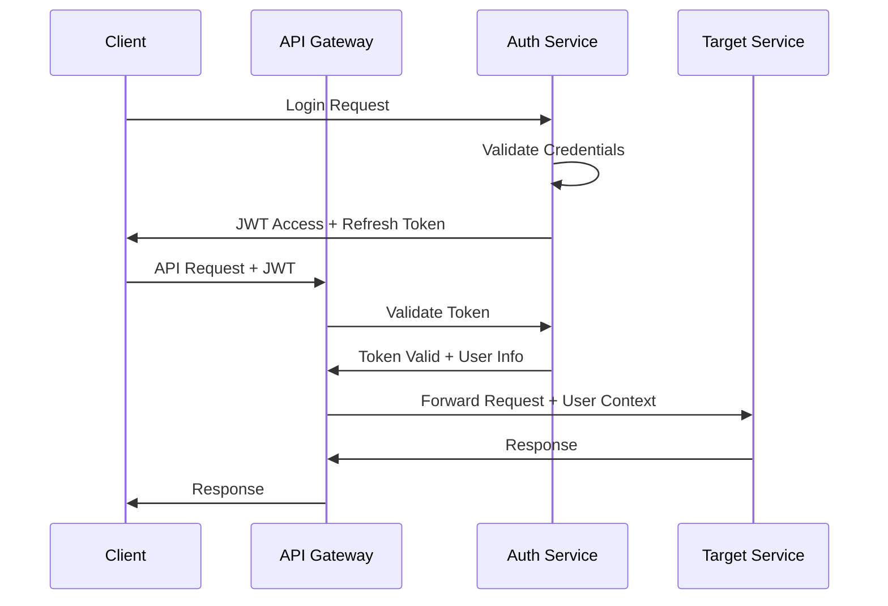
```mermaid
sequenceDiagram
    participant C as Client
    participant G as API Gateway
    participant A as Auth Service
    participant S as Target Service
    
    C->>A: Login Request
    A->>A: Validate Credentials
    A->>C: JWT Access + Refresh Token
    
    C->>G: API Request + JWT
    G->>A: Validate Token
    A->>G: Token Valid + User Info
    G->>S: Forward Request + User Context
    S->>G: Response
    G->>C: Response
```

### Multi-Tenant Security

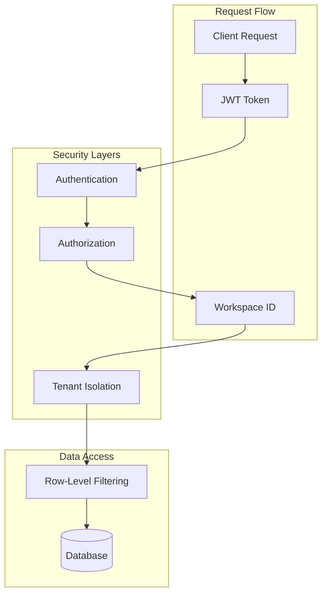
```mermaid
graph TB
    subgraph "Request Flow"
        REQ[Client Request]
        JWT[JWT Token]
        WORKSPACE[Workspace ID]
    end
    
    subgraph "Security Layers"
        AUTH[Authentication]
        AUTHZ[Authorization]
        TENANT[Tenant Isolation]
    end
    
    subgraph "Data Access"
        FILTER[Row-Level Filtering]
        DATA[(Database)]
    end
    
    REQ --> JWT
    JWT --> AUTH
    AUTH --> AUTHZ
    AUTHZ --> WORKSPACE
    WORKSPACE --> TENANT
    TENANT --> FILTER
    FILTER --> DATA
```

## 🚀 Deployment Architecture

### Container Orchestration

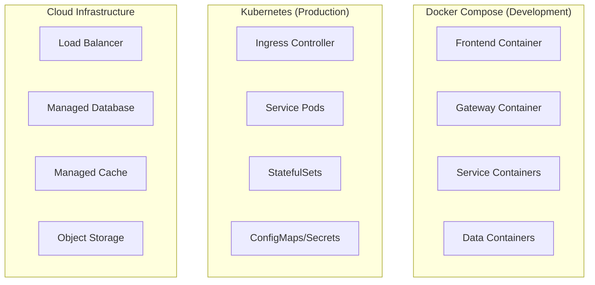
```mermaid
graph TB
    subgraph "Docker Compose (Development)"
        DC_FRONTEND[Frontend Container]
        DC_GATEWAY[Gateway Container]
        DC_SERVICES[Service Containers]
        DC_DATA[Data Containers]
    end
    
    subgraph "Kubernetes (Production)"
        K8S_INGRESS[Ingress Controller]
        K8S_SERVICES[Service Pods]
        K8S_DATA[StatefulSets]
        K8S_CONFIG[ConfigMaps/Secrets]
    end
    
    subgraph "Cloud Infrastructure"
        CLOUD_LB[Load Balancer]
        CLOUD_DB[Managed Database]
        CLOUD_CACHE[Managed Cache]
        CLOUD_STORAGE[Object Storage]
    end
```

### Scaling Strategy

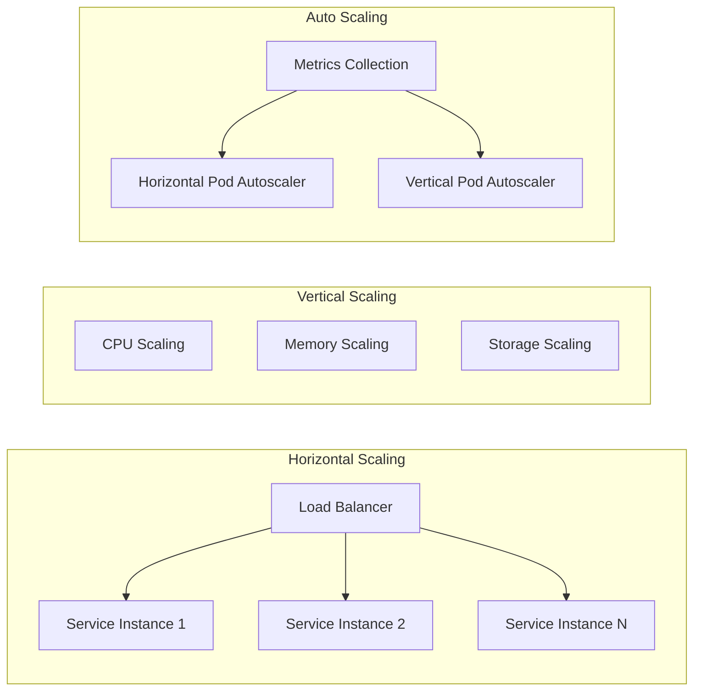
```mermaid
graph LR
    subgraph "Horizontal Scaling"
        LB[Load Balancer]
        S1[Service Instance 1]
        S2[Service Instance 2]
        S3[Service Instance N]
    end
    
    subgraph "Vertical Scaling"
        CPU[CPU Scaling]
        MEMORY[Memory Scaling]
        STORAGE[Storage Scaling]
    end
    
    subgraph "Auto Scaling"
        METRICS[Metrics Collection]
        HPA[Horizontal Pod Autoscaler]
        VPA[Vertical Pod Autoscaler]
    end
    
    LB --> S1
    LB --> S2
    LB --> S3
    
    METRICS --> HPA
    METRICS --> VPA
```

## 📈 Performance & Monitoring

### Observability Stack

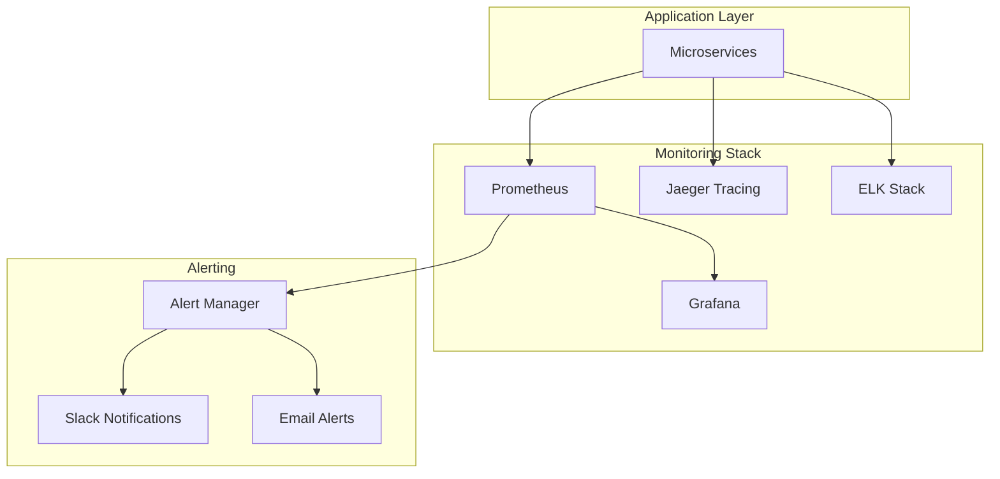
```mermaid
graph TB
    subgraph "Application Layer"
        APPS[Microservices]
    end
    
    subgraph "Monitoring Stack"
        PROMETHEUS[Prometheus]
        GRAFANA[Grafana]
        JAEGER[Jaeger Tracing]
        ELK[ELK Stack]
    end
    
    subgraph "Alerting"
        ALERTS[Alert Manager]
        SLACK[Slack Notifications]
        EMAIL[Email Alerts]
    end
    
    APPS --> PROMETHEUS
    APPS --> JAEGER
    APPS --> ELK
    
    PROMETHEUS --> GRAFANA
    PROMETHEUS --> ALERTS
    
    ALERTS --> SLACK
    ALERTS --> EMAIL
```

### Key Metrics

| Metric Type | Examples | Tools |
|-------------|----------|-------|
| **Application** | Request rate, Response time, Error rate | Prometheus, Grafana |
| **Infrastructure** | CPU, Memory, Disk, Network | Node Exporter, cAdvisor |
| **Business** | Orders/hour, Revenue, Success rate | Custom metrics |
| **User Experience** | Page load time, API latency | Real User Monitoring |

## 🔧 Development Workflow

### CI/CD Pipeline

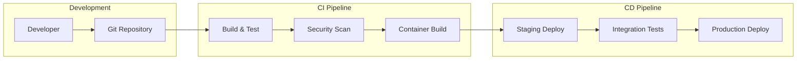
```mermaid
graph LR
    subgraph "Development"
        DEV[Developer]
        GIT[Git Repository]
    end
    
    subgraph "CI Pipeline"
        BUILD[Build & Test]
        SCAN[Security Scan]
        PACKAGE[Container Build]
    end
    
    subgraph "CD Pipeline"
        STAGING[Staging Deploy]
        TEST[Integration Tests]
        PROD[Production Deploy]
    end
    
    DEV --> GIT
    GIT --> BUILD
    BUILD --> SCAN
    SCAN --> PACKAGE
    PACKAGE --> STAGING
    STAGING --> TEST
    TEST --> PROD
```

This architecture documentation provides a comprehensive overview of the Delox system design, from high-level concepts to detailed implementation specifics.
